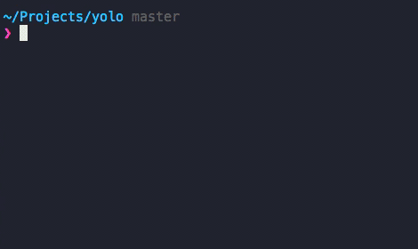

yolo-cli
========

> Easily drop & migrate local database





wut?
----
I usually screw up my local database in development and end up dropping it and
migrating from scratch, which requires a lot of commands. I would normally
define an alias in my shell but that becomes a problem if I work on many
projects.

This package simplifies that by letting you define `yolo.json` file with
`drop`, `build` and `post` commands for each project.

It will look for `yolo.json` in parent directories if one isn't present in
current folder and run defined commands in sequence.


And it's pretty :sparkles:

Example `yolo.json`
------------------
```json
{
  "drop": "dropdb yolo",
  "build": "createdb yolo",
  "post": "sequelize db:migrate"
}

```

And run `yolo` in any project directory.


Installation
------------
```bash
npm -g install yolo-cli
```


License
-------
MIT © Justyna Rachowicz
